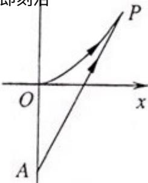

<!-- question-source:start -->
21. （6+8=14 分）海事救援船对一艘失事船进行定位：以失事船的当前位置为原点，以正北方向为 y 轴正方向建立平面直角坐标系（以 1 海里为单位长度），则救援船恰好在失事船正南方向 12 海

里 A 处，如图．现假设：①失事船的移动路径可视为抛物线 $y = \frac{12}{49} x^{2}$ ；②定位后救援船即刻沿

直线匀速前往救援；③救援船出发 $t$ 小时后，失事船所在位置的横坐标为 $7t$ ：

(1) 当 $t = 0.5$ 时，写出失事船所在位置 $P$ 的纵坐标。若此时两船恰好会合，求救援船速度的大小和方向；

(2) 问救援船的时速至少是多少海里才能追上失事船？

<!-- question-source:end -->

![[高中/真题/按年份分类/2012/2012年上海高考数学真题_理科_试卷_word解析版_/解答题/题目/answers/Q00023283A1.md]]
