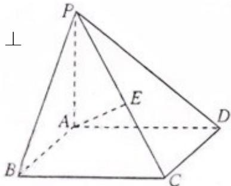

<!-- question-source:start -->
19. (6+6=12 分) 如图, 在四棱锥 $P - ABCD$ 中, 底面 $ABCD$ 是矩形, $PA \perp$ 底面 $ABCD$ , $E$ 是 $PC$ 的中点, 已知 $AB = 2$ , $AD = 2\sqrt{2}$ , $PA = 2$ , 求:

(1) 三角形 PCD 的面积;

(2) 异面直线 BC 与 AE 所成的角的大小。

<!-- question-source:end -->

![[高中/真题/按年份分类/2012/2012年上海高考数学真题_理科_试卷_word解析版_/选择题/题目/answers/Q00023281A1.md]]
