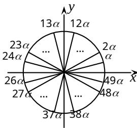

> [!faq]- 2012年上海高考数学真题（理科）试卷（word解析版）解析
>
> > [!success]- **【答案】** D
>
> > [!note]- **【分析】**
> > 本题未单列分析。
>
> > [!note]- **【解析】**
> > 对于 $1 \leq k \leq 25, a_{k} \geq 0$ (唯 $a_{25} = 0$ ), 所以 $S_{k}(1 \leq k \leq 25)$ 都为正数.
> >
> > 当 $26 \leq k \leq 49$ 时, 令 $\frac{\pi}{25} = \alpha$ , 则 $\frac{k\pi}{25} = k\alpha$ , 画出 $k\alpha$ 终边如右,
> >
> > 其终边两两关于 x 轴对称, 即有 $\sin k\alpha = -\sin(50 - k\alpha)$ ,
> >
> > 所以 $S_{k} = \frac{1}{1}\sin\alpha + \frac{1}{2}\sin2\alpha + \frac{1}{23}\sin23\alpha + \frac{1}{24}\sin24\alpha + 0$ $+ \frac{1}{26}\sin26\alpha + \frac{1}{27}\sin27\alpha + \frac{1}{k}\sin k\alpha$ $= \frac{1}{1}\sin\alpha + \frac{1}{2}\sin2\alpha + (\frac{1}{24} - \frac{1}{26})\sin24\alpha + (\frac{1}{23} - \frac{1}{27})\sin23\alpha +$ $+ (\frac{1}{50-k} - \frac{1}{k})\sin(50-k)\alpha$ , 其中 k = 26, 27, 49, 此时 0 < 50 - k < k,
> >
> > 所以 $\frac{1}{50-k} - \frac{1}{k} > 0$ , 又 $0 < (50-k)\alpha \leq 24\alpha < \pi$ , 所以 $\sin(50-k)\alpha > 0$ ,
> >
> > 从而当 k = 26, 27, 49 时, $S_{k}$ 都是正数, $S_{50} = S_{49} + a_{50} = S_{49} + 0 = S_{49} > 0$ .
> >
> > 对于 k 从 51 到 100 的情况同上可知 $S_{k}$ 都是正数. 综上, 可选 D.
> >
> > [评注] 本题中数列难于求和, 可通过数列中项的正、负匹配来分析 $S_{k}$ 的符号, 为此, 需借论、数形结合、先局部再整体等数学思想. 而重中之重, 是看清楚角序列的终边的对称题之关键.
> >
> > 
> >
> > ##
