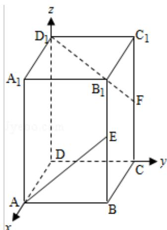

> [!faq]- 2012年全国统一高考数学试卷（文科）（大纲版）（含解析版）解析
>
> > [!success]- **【答案】** $\frac{3}{5}$
>
> > [!note]- **【分析】**
> > 设正方体 ABCD - A₁B₁C₁D₁棱长为 2，以 DA 为 x 轴，DC 为 y 轴，DD₁ 为 z 轴，
>
> > [!note]- **【解析】**
> > 解：设正方体 ABCD - A₁B₁C₁D₁棱长为 2，以 DA 为 x 轴，DC 为 y 轴，DD₁为 z
> >
> > 轴，
> >
> > 建立空间直角坐标系，
> >
> > 则 A $(2, 0, 0)$ ，E $(2, 2, 1)$ $D_{1}$ $(0, 0, 2)$ ，F $(0, 2, 1)$
> >
> > $\therefore \overrightarrow{AE} = (0, 2, 1), \overrightarrow{D_1F} = (0, 2, -1)$
> >
> > 设异面直线 AE 与 $D_{1}F$ 所成角为 $\theta$ ，
> >
> > 则 $\cos \theta = |\cos < \overrightarrow{\mathrm{AE}},\overrightarrow{\mathrm{D}_1\mathrm{F}} >| = |\frac{0 + 4 - 1}{\sqrt{5}\cdot\sqrt{5}} | = \frac{3}{5}.$
> >
> > 故答案为： $\frac{3}{5}$ .
> >
> > 
