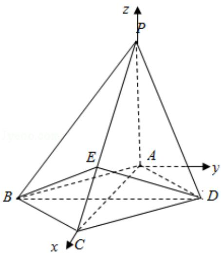

> [!faq]- 2012年全国统一高考数学试卷（文科）（大纲版）（含解析版）解析
>
> > [!success]- **【答案】** 详见解析
>
> > [!note]- **【分析】**
> > (1) 先由已知建立空间直角坐标系, 设 D( $\sqrt{2}$ , b, 0), 从而写出相关点和相
>
> > [!note]- **【解析】**
> > 解：（I）以 A 为坐标原点，建立如图空间直角坐标系 A - xyz，
> >
> > 设 $D(\sqrt{2}, b, 0)$ ，则 $C(2\sqrt{2}, 0, 0), P(0, 0, 2), E(\frac{4\sqrt{2}}{3}, 0, \frac{2}{3}), B(\sqrt{2}, -b, 0)$
> >
> > $\therefore \overrightarrow{\mathrm{PC}} = (2\sqrt{2}, 0, -2)$ ， $\overrightarrow{\mathrm{BE}} = (\frac{\sqrt{2}}{3}, b, \frac{2}{3})$ ， $\overrightarrow{\mathrm{DE}} = (\frac{\sqrt{2}}{3}, -b, \frac{2}{3})$
> >
> > $$
> > \therefore \overrightarrow {\mathrm{PC}} \bullet \overrightarrow {\mathrm{BE}} = \frac {4}{3} - \frac {4}{3} = 0, \overrightarrow {\mathrm{PC}} \cdot \overrightarrow {\mathrm{DE}} = 0
> > $$
> >
> > ∴PC⊥BE, PC⊥DE, BE∩DE=E
> >
> > ∴PC⊥平面 BED
> >
> > (II) $\overrightarrow{AP}=$ (0, 0, 2), $\overrightarrow{AB}=$ ( $\sqrt{2}$ , -b, 0)
> >
> > 设平面PAB的法向量为 $\vec{\pi} = (x, y, z)$ ，则 $\left\{ \begin{array}{l} \vec{m} \cdot \overrightarrow{AP} = 2z = 0 \\ \vec{m} \cdot \overrightarrow{AB} = \sqrt{2} x - by = 0 \end{array} \right.$
> >
> > 取 $\vec{\pi}=(b,\sqrt{2},0)$
> >
> > 设平面PBC的法向量为 $\vec{\mathbf{n}} = (p, q, r)$ ，则 $\left\{ \begin{array}{l} \vec{\mathrm{n}} \cdot \overrightarrow{\mathrm{PC}} = 2\sqrt{2} p - 2r = 0 \\ \vec{\mathrm{n}} \cdot \overrightarrow{\mathrm{BE}} = \frac{\sqrt{2}}{3} p + bq + \frac{2}{3} r = 0 \end{array} \right.$
> >
> > 取 $\vec{\mathrm{n}} = (1, -\frac{\sqrt{2}}{\mathrm{b}}, \sqrt{2})$
> >
> > ∵平面PAB⊥平面PBC，∴ $\vec{\pi}\cdot\vec{n}=b-\frac{2}{b}=0$ 。故 $b=\sqrt{2}$
> >
> > $$
> > \therefore \overrightarrow {n} = (1, - 1, \sqrt {2}), \overrightarrow {D P} = (- \sqrt {2}, - \sqrt {2}, 2)
> > $$
> >
> > $$
> > \therefore \cos <   \overrightarrow {D P}, \quad \overrightarrow {n} > = \frac {\overrightarrow {n} \cdot \overrightarrow {D P}}{| \overrightarrow {n} | \cdot | \overrightarrow {D P} |} = \frac {1}{2}
> > $$
> >
> > 设 PD 与平面 PBC 所成角为 $\theta$ ， $\theta \in [0, \frac{\pi}{2}]$ ，则 $\sin \theta = \frac{1}{2}$
> >
> > $\therefore \theta = 30^{\circ}$
> >
> > ∴PD 与平面 PBC 所成角的大小为 $30^{\circ}$
> >
> > 
> >
> > 【点评】本题主要考查了利用空间直角坐标系和空间向量解决立体几何问题的一般方法，线面垂直的判定定理，空间线面角的求法，有一定的运算量，属中档题
