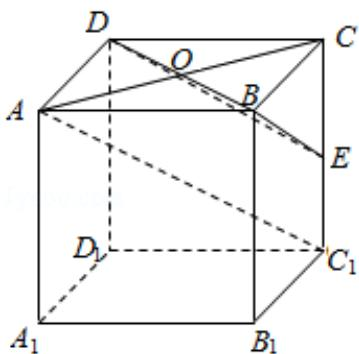

> [!faq]- 2012年全国统一高考数学试卷（文科）（大纲版）（含解析版）解析
>
> > [!success]- **【答案】** D
>
> > [!note]- **【分析】**
> > 先利用线面平行的判定定理证明直线 $C_{1}A$ 平面BDE，再将线面距离转化
>
> > [!note]- **【解析】**
> > 解: 如图: 连接 AC, 交 BD 于 O, 在三角形 $CC_{1}A$ 中, 易证 $OE\|C_{1}A$ , 从而 $C_{1}A\|$
> >
> > 平面 BDE，
> >
> > ∴直线 $AC_{1}$ 与平面 BED 的距离即为点 A 到平面 BED 的距离，设为 h，
> >
> > 在三棱锥 E-ABD 中， $V_{E-ABD}=\frac{1}{3}S_{\triangle ABD}\times EC=\frac{1}{3}\times\frac{1}{2}\times2\times2\times\sqrt{2}=\frac{2\sqrt{2}}{3}$
> >
> > 在三棱锥A-BDE中， $BD = 2\sqrt{2}$ ， $\mathrm{BE} = \sqrt{6}$ ， $\mathrm{DE} = \sqrt{6}$ ， $\therefore S_{\triangle EBD} = \frac{1}{2}\times 2\sqrt{2}\times \sqrt{6 - 2} = 2\sqrt{2}$
> >
> > $$
> > \therefore V _ {A - B D E} = \frac {t ^ {2}}{1 6} \frac {t ^ {2}}{1 2} \times S _ {\triangle E B D} \times h = \frac {t ^ {2}}{1 6} \frac {t ^ {2}}{1 2} \times 2 \sqrt {2} \times h = \frac {2 \sqrt {2}}{3}
> > $$
> >
> > ∴h=1
> >
> > 故选：D.
> >
> > 
> >
> > 【点评】本题主要考查了线面平行的判定，线面距离与点面距离的转化，三棱锥的
> >
> > 体积计算方法，等体积法求点面距离的技巧，属基础题
