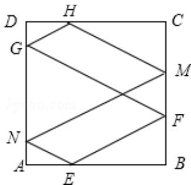

> [!faq]- 2012年全国统一高考数学试卷（文科）（大纲版）（含解析版）解析
>
> > [!success]- **【答案】** B
>
> > [!note]- **【分析】**
> > 根据已知中的点 E, F 的位置, 可知入射角的正切值为 $\frac{1}{2}$ , 通过相似三角形来确定反射后的点的位置, 从而可得反射的次数.
>
> > [!note]- **【解析】**
> > 分析】根据已知中的点 E, F 的位置, 可知入射角的正切值为 $\frac{1}{2}$ , 通过相似三角形来确定反射后的点的位置, 从而可得反射的次数.
> >
> > 【
> > 解答】解：根据已知中的点 E，F 的位置，可知入射角的正切值为 $\frac{1}{2}$ ，第一次碰撞点为 F，在反射的过程中，直线是平行的，利用平行关系及三角形的相似可得第二次碰撞点为 G，在 DA，且 $DG=\frac{1}{6}$ ，第三次碰撞点为 H，在 DC 上，且 $DH=\frac{1}{3}$ ，第四次碰撞点为 M，在 CB 上，且 $CM=\frac{1}{3}$ ，第五次碰撞点为 N，在 DA 上，且 AN=
> >
> > $\frac{1}{6}$ ，第六次回到 E 点， $AE=\frac{1}{3}$ .
> >
> > 故需要碰撞 6 次即可.
> >
> > 故选：B.
> >
> > 
> >
> > 【点评】本题主要考查了反射原理与三角形相似知识的运用. 通过相似三角形, 来
> >
> > 确定反射后的点的位置，从而可得反射的次数，属于难题
> >
> > ## 二、填空题（共4小题，每小题5分，共20分，在试卷上作答无效）
