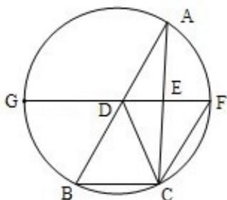

<!-- question-source:start -->
22. (10 分) 如图, D, E 分别为 $\triangle ABC$ 边 $AB$ , $AC$ 的中点, 直线 $DE$ 交 $\triangle ABC$ 的外接圆

于 F，G 两点，若 CF∥AB，证明：

(1) CD=BC;

(2) $\triangle BCD \sim \triangle GBD.$

<!-- question-source:end -->

![[高中/真题/按年份分类/2012/2012年全国统一高考数学试卷_文科__新课标__含解析版_/填空题/题目/answers/Q00025025A1.md]]
