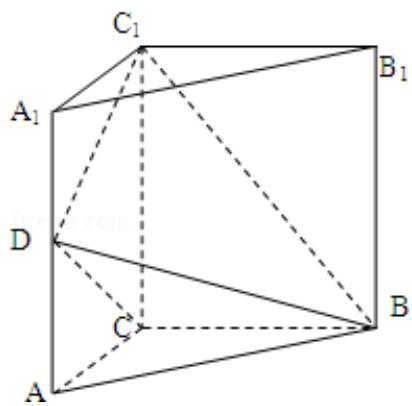

<!-- question-source:start -->
19. (12 分) 如图, 三棱柱 $ABC - A_{1}B_{1}C_{1}$ 中, 侧棱垂直底面, $\angle ACB = 90^{\circ}$ , $AC = BC = \frac{1}{2}$

$AA_{1}$ ，D 是棱 $AA_{1}$ 的中点.

(Ⅰ) 证明: 平面 $\mathrm{BDC}_{1} \perp$ 平面 BDC

(II) 平面 $\mathrm{BDC}_{1}$ 分此棱柱为两部分, 求这两部分体积的比.

<!-- question-source:end -->

![[高中/真题/按年份分类/2012/2012年全国统一高考数学试卷_文科__新课标__含解析版_/解答题/题目/answers/Q00024720A1.md]]
