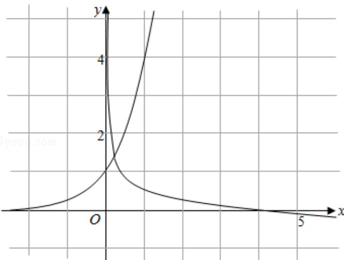

> [!faq]- 2012年全国统一高考数学试卷（文科）（新课标）（含解析版）解析
>
> > [!success]- **【答案】** B
>
> > [!note]- **【分析】**
> > 由指数函数和对数函数的图象和性质，将已知不等式转化为不等式恒成
>
> > [!note]- **【解析】**
> > 分析】由指数函数和对数函数的图象和性质，将已知不等式转化为不等式恒成
> >
> > 立问题加以解决即可
> >
> > 【
> > 解答】解： $\because 0 < x \leq \frac{1}{2}$ 时， $1 < 4^x \leq 2$
> >
> > 要使 $4^{x}<\log_{a}x$ ，由对数函数的性质可得 0<a<1，
> >
> > 数形结合可知只需 $2 < \log_{a}x$
> >
> > $$
> > \therefore \left\{ \begin{array}{l} 0 <   a <   1 \\ \log_ {a} a ^ {2} <   \log_ {a} x \end{array} \right.
> > $$
> >
> > 即 $\left\{ \begin{array}{l} 0 < a < 1 \\ a^2 > x \end{array} \right.$ 对 $0 < x \leq \frac{1}{2}$ 时恒成立
> >
> > $$
> > \therefore \left\{ \begin{array}{l} 0 <   a <   1 \\ a ^ {2} > \frac {1}{2} \end{array} \right.
> > $$
> >
> > 解得 $\frac{\sqrt{2}}{2} < a < 1$
> >
> > 故选：B.
> >
> > 
> >
> > 【点评】本题主要考查了指数函数和对数函数的图象和性质，不等式恒成立问题
> >
> > 的一般解法，属基础题
