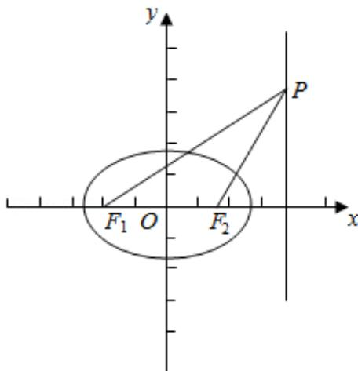

> [!faq]- 2012年全国统一高考数学试卷（文科）（新课标）（含解析版）解析
>
> > [!success]- **【答案】** C
>
> > [!note]- **【分析】**
> > 利用 $\triangle F_{2}PF_{1}$ 是底角为 $30^{\circ}$ 的等腰三角形，可得 $\left|PF_{2}\right| = \left|F_{2}F_{1}\right|$ ，根据P为直线
>
> > [!note]- **【解析】**
> > 解：∵ $\triangle F_{2}PF_{1}$ 是底角为 $30^{\circ}$ 的等腰三角形，
> >
> > $$
> > \therefore \left| P F _ {2} \right| = \left| F _ {2} F _ {1} \right|
> > $$
> >
> > ∵P为直线 $x=\frac{3a}{2}$ 上一点
> >
> > $$
> > \therefore 2 \left(\frac {3}{2} a - c\right) = 2 c
> > $$
> >
> > $$
> > \therefore e = \frac {c}{a} = \frac {3}{4}
> > $$
> >
> > 故选：C.
> >
> > 
> >
> > 【点评】本题考查椭圆的几何性质, 解题的关键是确定几何量之间的关系, 属于基
> > 础题.
