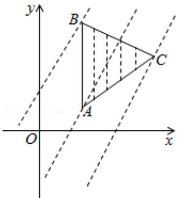

> [!faq]- 2012年全国统一高考数学试卷（文科）（新课标）（含解析版）解析
>
> > [!success]- **【答案】** A
>
> > [!note]- **【分析】**
> > 由 A, B 及 $\triangle ABC$ 为正三角形可得, 可求 C 的坐标, 然后把三角形的各顶点
>
> > [!note]- **【解析】**
> > 解：设 C（a，b），（a>0，b>0）
> >
> > 由 A（1，1），B（1，3），及△ABC 为正三角形可得，AB=AC=BC=2
> >
> > 即 $(a-1)^{2}+(b-1)^{2}=(a-1)^{2}+(b-3)^{2}=4$
> >
> > $\therefore b = 2, a = 1 + \sqrt{3}$ 即 $C(1 + \sqrt{3}, 2)$
> >
> > 则此时直线 AB 的方程 x=1，AC 的方程为 $y-1=\frac{\sqrt{3}}{3}(x-1)$ ，
> >
> > 直线BC的方程为 $y - 3 = -\frac{\sqrt{3}}{3} (x - 1)$
> >
> > 当直线 $x - y + z = 0$ 经过点 A(1, 1) 时，z = 0，经过点 B(1, 3) z = 2，经过点 C( $1 + \sqrt{3}$ , 2)
> >
> > 时， $z = 1 - \sqrt{3}$
> >
> > $$
> > \therefore z _ {\max} = 2, \quad z _ {\min} = 1 - \sqrt {3}
> > $$
> >
> > 故选：A.
> >
> > 
> >
> > 【点评】考查学生线性规划的理解和认识, 考查学生的数形结合思想. 属于基本题
> > 型.
