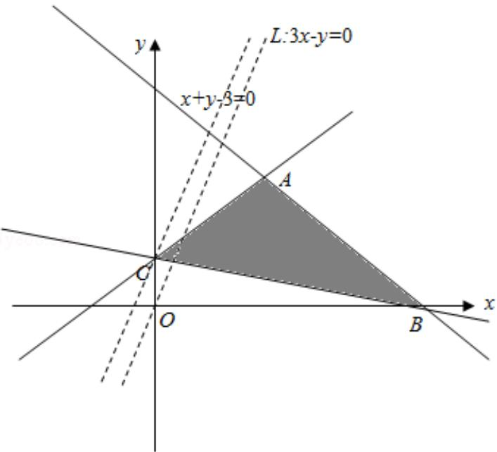

> [!faq]- 2012年全国统一高考数学试卷（理科）（大纲版）（含解析版）解析
>
> > [!success]- **【答案】** -1
>
> > [!note]- **【分析】**
> > 作出不等式组表示的平面区域，由 $z = 3x - y$ 可得 $y = 3x - z$ ，则 $-z$ 表示直线
>
> > [!note]- **【解析】**
> > 解：作出不等式组 $\left\{ \begin{array}{l} x - y + 1 \geqslant 0 \\ x + y - 3 \leqslant 0 \\ x + 3y - 3 \geqslant 0 \end{array} \right.$ 表示的平面区域，如图所示
> >
> > 由 z=3x-y 可得 y=3x-z，则 -z 表示直线 3x-y-z=0 在 y 轴上的截距，截距越大
> >
> > z 越小
> >
> > 结合图形可知，当直线 z=3x-y 过点 C 时 z 最小
> >
> > 由 $\left\{ \begin{array}{l} x + 3y - 3 = 0 \\ x - y + 1 = 0 \end{array} \right.$ 可得 $C(0, 1)$ ，此时 $z = -1$
> >
> > 故答案为：-1
> >
> > 
