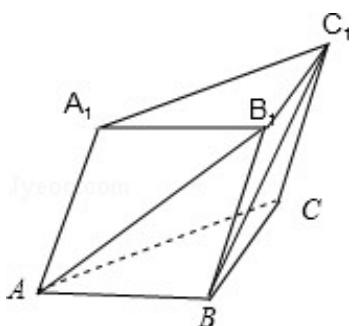

> [!faq]- 2012年全国统一高考数学试卷（理科）（大纲版）（含解析版）解析
>
> > [!success]- **【答案】** 详见解析
>
> > [!note]- **【分析】**
> > 先选一组基底，再利用向量加法和减法的三角形法则和平行四边形法则
>
> > [!note]- **【解析】**
> > 分析】先选一组基底，再利用向量加法和减法的三角形法则和平行四边形法则
> >
> > 将两条异面直线的方向向量用基底表示, 最后利用夹角公式求异面直线 $AB_{1}$ 与
> >
> > $BC_{1}$ 所成角的余弦值即可
> >
> > 【
> > 解答】解：如图，设 $\overrightarrow{AA_1} = \overrightarrow{c}$ ， $\overrightarrow{AB} = \overrightarrow{a}$ ， $\overrightarrow{AC} = \overrightarrow{b}$ ，棱长均为1，
> >
> > 则 $\vec{a} \cdot \vec{b} = \frac{1}{2}$ , $\vec{b} \cdot \vec{c} = \frac{1}{2}$ , $\overrightarrow{CB} = \frac{1}{2}$
> >
> > $$
> > \because \overrightarrow {A B _ {1}} = \overrightarrow {a} + \overrightarrow {c}, \quad \overrightarrow {B C _ {1}} = \overrightarrow {B C} + \overrightarrow {B B _ {1}} = \overrightarrow {b} - \overrightarrow {a} + \overrightarrow {c}
> > $$
> >
> > $$
> > \therefore \overrightarrow {A B _ {1}} \cdot \overrightarrow {B C _ {1}} = (\overrightarrow {a + c}) \cdot (\overrightarrow {b - a + c}) = \overrightarrow {a} \cdot \overrightarrow {b - a ^ {2}} + \overrightarrow {a} \cdot \overrightarrow {c + b} \cdot \overrightarrow {c - a} \cdot \overrightarrow {c + c ^ {2}}
> > $$
> >
> > $$
> > = \overrightarrow {a} \cdot \overrightarrow {b} - \overrightarrow {a} ^ {2} + \overrightarrow {b} \cdot \overrightarrow {c} + \overrightarrow {c} ^ {2} = \frac {1}{2} - 1 + \frac {1}{2} + 1 = 1
> > $$
> >
> > $$
> > | \overrightarrow {A B _ {1}} | = \sqrt {(\vec {a} + \vec {c}) ^ {2}} = \sqrt {1 + 1 + 1} = \sqrt {3}
> > $$
> >
> > $$
> > \left| \overrightarrow {B C _ {1}} \right| = \sqrt {\left(\overrightarrow {b} - \overrightarrow {a} + \overrightarrow {c}\right) ^ {2}} = \sqrt {1 + 1 + 1 - 1 - 1 + 1} = \sqrt {2}
> > $$
> >
> > $$
> > \therefore \cos <   \overrightarrow {A B _ {1}}, \overrightarrow {B C _ {1}} > = \frac {\overrightarrow {A B _ {1}} \cdot \overrightarrow {B C _ {1}}}{| \overrightarrow {A B _ {1}} | \cdot | \overrightarrow {B C _ {1}} |} = \frac {1}{\sqrt {2} \times \sqrt {3}} = \frac {\sqrt {6}}{6}
> > $$
> >
> > $\therefore$ 异面直线 $\mathrm{AB}_1$ 与 $\mathrm{BC}_1$ 所成角的余弦值为 $\frac{\sqrt{6}}{6}$
> >
> > 
> >
> > 【点评】本题主要考查了空间向量在解决立体几何问题中的应用，空间向量基本
> >
> > 定理，向量数量积运算的性质及夹角公式的应用，有一定的运算量
