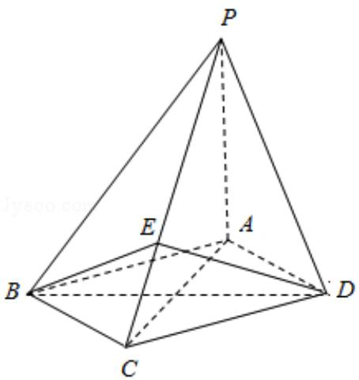

<!-- question-source:start -->
18. （12分）如图，四棱锥P-ABCD中，底面ABCD为菱形，PA⊥底面ABCD， $\mathrm{AC} = 2\sqrt{2}$ ， $\mathrm{PA} = 2$ ，E是PC上的一点，PE=2EC.

（Ⅰ）证明：PC⊥平面 BED；

（II）设二面角 A-PB-C 为 $90^{\circ}$ ，求 PD 与平面 PBC 所成角的大小.

<!-- question-source:end -->

![[高中/真题/按年份分类/2012/2012年全国统一高考数学试卷_理科__大纲版__含解析版_/解答题/题目/answers/Q00024331A1.md]]
