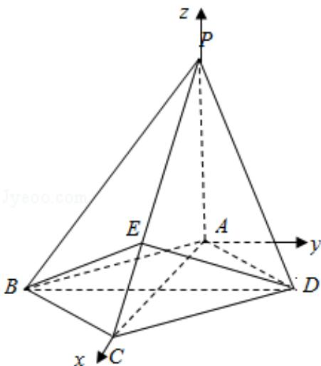

> [!faq]- 2012年全国统一高考数学试卷（理科）（大纲版）（含解析版）解析
>
> > [!success]- **【答案】** 详见解析
>
> > [!note]- **【分析】**
> > 本题未单列分析。
>
> > [!note]- **【解析】**
> > 解答】解：（I）以 A 为坐标原点，建立如图空间直角坐标系 A - xyz，
> >
> > 设 $D(\sqrt{2}, b, 0)$ ，则 $C(2\sqrt{2}, 0, 0), P(0, 0, 2), E(\frac{4\sqrt{2}}{3}, 0, \frac{2}{3}), B(\sqrt{2}, -b, 0)$
> >
> > $\therefore \overrightarrow{\mathrm{PC}} = (2\sqrt{2}, 0, -2), \overrightarrow{\mathrm{BE}} = (\frac{\sqrt{2}}{3}, b, \frac{2}{3}), \overrightarrow{\mathrm{DE}} = (\frac{\sqrt{2}}{3}, -b, \frac{2}{3})$
> >
> > $$
> > \therefore \overrightarrow {\mathrm{PC}} \bullet \overrightarrow {\mathrm{BE}} = \frac {4}{3} - \frac {4}{3} = 0, \overrightarrow {\mathrm{PC}} \bullet \overrightarrow {\mathrm{DE}} = 0
> > $$
> >
> > ∴PC⊥BE, PC⊥DE, BE∩DE=E
> >
> > ∴PC⊥平面 BED
> >
> > (II) $\overrightarrow{AP} = (0, 0, 2)$ , $\overrightarrow{AB} = (\sqrt{2}, -b, 0)$
> >
> > 设平面PAB的法向量为 $\vec{\pi} = (x, y, z)$ ，则 $\left\{ \begin{array}{l} \vec{m} \cdot \overrightarrow{AP} = 2z = 0 \\ \vec{m} \cdot \overrightarrow{AB} = \sqrt{2} x - by = 0 \end{array} \right.$
> >
> > 取 $\vec{\pi} = (b, \sqrt{2}, 0)$
> >
> > 设平面PBC的法向量为 $\vec{n} = (p, q, r)$ ，则 $\left\{ \begin{array}{l} \vec{n} \cdot \overrightarrow{PC} = 2\sqrt{2} p - 2r = 0 \\ \vec{n} \cdot \overrightarrow{BE} = \frac{\sqrt{2}}{3} p + bq + \frac{2}{3} r = 0 \end{array} \right.$ 取 $\vec{n} = (1, -\frac{\sqrt{2}}{b}, \sqrt{2})$ $\because$ 平面PAB⊥平面PBC， $\therefore \vec{\pi} \cdot \vec{n} = b - \frac{2}{b} = 0$ 。故 $b = \sqrt{2}$ $\therefore \vec{n} = (1, -1, \sqrt{2})$ ， $\overrightarrow{DP} = (-\sqrt{2}, -\sqrt{2}, 2)$ $\therefore \cos < \overrightarrow{DP}, \vec{n} > = \frac{\vec{n} \cdot \overrightarrow{DP}}{|\vec{n}| \cdot |\overrightarrow{DP}|} = \frac{1}{2}$ 设PD与平面PBC所成角为 $\theta$ ， $\theta \in [0, \frac{\pi}{2}]$ ，则 $\sin \theta = \frac{1}{2}$ $\therefore \theta = 30^\circ$
> >
> > ∴PD 与平面 PBC 所成角的大小为 $30^{\circ}$
> >
> > 
> >
> > 【点评】本题主要考查了利用空间直角坐标系和空间向量解决立体几何问题的一般方法，线面垂直的判定定理，空间线面角的求法，有一定的运算量，属中档
> >
> > 题
