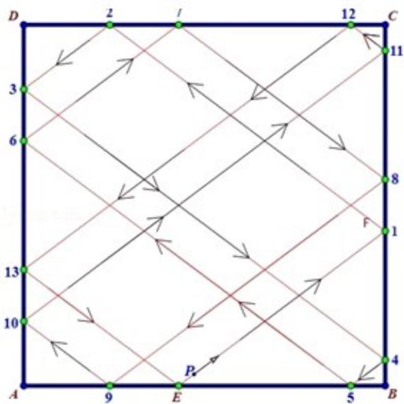

> [!faq]- 2012年全国统一高考数学试卷（理科）（大纲版）（含解析版）解析
>
> > [!success]- **【答案】** B
>
> > [!note]- **【分析】**
> > 通过相似三角形, 来确定反射后的点的落的位置, 结合图象
>
> > [!note]- **【解析】**
> > 分析】通过相似三角形, 来确定反射后的点的落的位置, 结合图象
> > 分析反射的次数即可.
> >
> > 【
> > 解答】解: 根据已知中的点 E, F 的位置, 可知第一次碰撞点为 F, 在反射的过程中,
> >
> > 直线是平行的，利用平行关系及三角形的相似可得第二次碰撞点为 G，且 CG=
> >
> > $\frac{16}{21}$ ，第二次碰撞点为 $H$ ，且 $DH = (1 - \frac{16}{21}) \times \frac{3}{4} = \frac{5}{28}$ ，作图，
> >
> > 可以得到回到 E 点时，需要碰撞 14 次即可.
> >
> > 故选：B.
> >
> > 
> >
> > 【点评】本题主要考查了反射原理与三角形相似知识的运用. 通过相似三角形, 来
> > 确定反射后的点的落的位置，结合图象
> > 分析反射的次数即可，属于难题.
> >
> > ## 二、填空题: 本大题共 4 小题, 每小题 5 分, 共 20 分, 把
> > 答案填在题中横线上. (注
> >
> > 意：在试题卷上作答无效）
