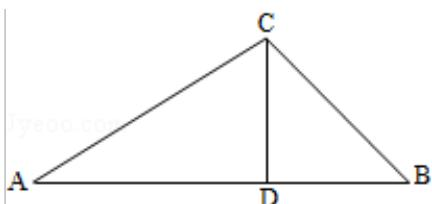

> [!faq]- 2012年全国统一高考数学试卷（理科）（大纲版）（含解析版）解析
>
> > [!success]- **【答案】** D
>
> > [!note]- **【分析】**
> > 由题意可得，CA⊥CB，CD⊥AB，由射影定理可得，AC²=AD•AB 可求 AD，进而可求 $\frac{AD}{AB}$ ，从而可求 $\overrightarrow{AD}$ 与 $\overrightarrow{AB}$ 的关系，进而可求
>
> > [!note]- **【解析】**
> > 解：∵ $\vec{a}\cdot\vec{b}=0$ ,
> >
> > $\therefore$ CA⊥CB
> >
> > $$
> > \because C D \perp A B
> > $$
> >
> > $$
> > \because | \vec {a} | = 1, | \vec {b} | = 2
> > $$
> >
> > $$
> > \therefore A B = \sqrt {5}
> > $$
> >
> > 由射影定理可得， $AC^{2}=AD\bullet AB$
> >
> > $$
> > \therefore A D = \frac {4}{\sqrt {5}} = \frac {4 \sqrt {5}}{5}
> > $$
> >
> > $$
> > \therefore \frac {A D}{A B} = \frac {\frac {4 \sqrt {5}}{5}}{\sqrt {5}} = \frac {4}{5}
> > $$
> >
> > $$
> > \therefore \overrightarrow {A D} = \frac {4}{5} \overrightarrow {A B} = \frac {4}{5} (\overrightarrow {C B} - \overrightarrow {C A}) = \frac {4}{5} (\overrightarrow {a} - \overrightarrow {b})
> > $$
> >
> > 故选：D.
> >
> > 
> >
> > 【点评】本题主要考查了直角三角形的射影定理的应用,向量的基本运算的应用,
> >
> > 向量的数量积的性质的应用.
