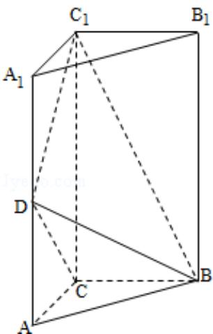

<!-- question-source:start -->
19. （12分）如图，直三棱柱 $ABC - A_{1}B_{1}C_{1}$ 中， $AC = BC = \frac{1}{2} AA_{1}$ ，D是棱 $AA_{1}$ 的中点， $DC_{1} \perp BD$

(1) 证明: $\mathrm{DC}_{1} \perp \mathrm{BC}$ ;

(2) 求二面角 $A_{1} - BD - C_{1}$ 的大小.

<!-- question-source:end -->

![[高中/真题/按年份分类/2012/2012年全国统一高考数学试卷_理科__新课标__含解析版_/填空题/题目/answers/Q00024400A1.md]]
