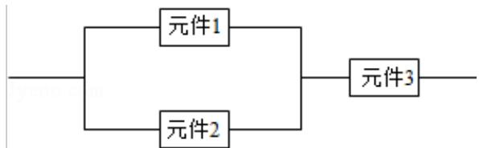

<!-- question-source:start -->
15. (5 分) 某个部件由三个元件按下图方式连接而成, 元件 1 或元件 2 正常工作
且元件 3 正常工作, 则部件正常工作, 设三个电子元件的使用寿命 (单位: 小时) 均服从正态分布 N(1000, 50²), 且各个元件能否正常相互独立, 那么该部件的使用寿命超过 1000 小时的概率为 \_\_\_\_.

<!-- question-source:end -->

![[高中/真题/按年份分类/2012/2012年全国统一高考数学试卷_理科__新课标__含解析版_/填空题/题目/answers/Q00025432A1.md]]
