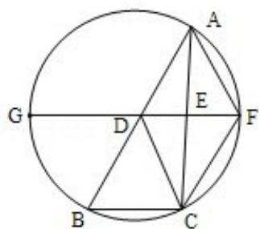

> [!faq]- 2012年全国统一高考数学试卷（理科）（新课标）（含解析版）解析
>
> > [!success]- **【答案】** 详见解析
>
> > [!note]- **【分析】**
> > （1）根据 D，E 分别为 $\triangle ABC$ 边 AB，AC 的中点，可得 DE∥BC，证明四边形
>
> > [!note]- **【解析】**
> > 证明：（1）∵D，E分别为△ABC边AB，AC的中点
> >
> > ∴DF∥BC, AD=DB
> >
> > ∵AB∥CF，∴四边形 BDFC 是平行四边形
> >
> > $\therefore CF\|BD,\quad CF=BD$
> >
> > $\therefore CF\|AD,\quad CF=AD$
> >
> > ∴四边形 ADCF 是平行四边形
> >
> > $\therefore AF=CD$
> >
> > $$
> > \because \widehat {B C} = \widehat {A F}, \quad \therefore B C = A F, \quad \therefore C D = B C.
> > $$
> > (2) 由
> > (1) 知 $\widehat{BC} = \widehat{AF}$ , 所以 $\widehat{BF} = \widehat{AC}$ .
> >
> > 所以 $\angle BGD = \angle DBC$
> >
> > 因为 $GF \parallel BC$ ，所以 $\angle BDG = \angle ADF = \angle DBC = \angle BDC$ .
> >
> > 所以 $\triangle BCD\sim\triangle GBD.$
> >
> > 
> >
> > 【点评】本题考查几何证明选讲，考查平行四边形的证明，考查三角形的相似，属
> >
> > 于基础题.
