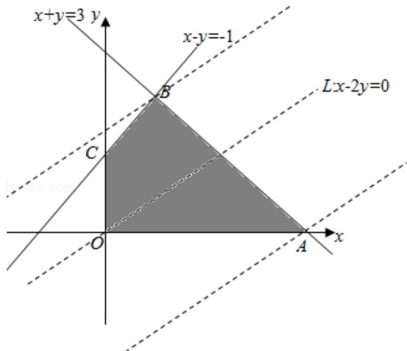

> [!faq]- 2012年全国统一高考数学试卷（理科）（新课标）（含解析版）解析
>
> > [!success]- **【答案】** 为： $[-3, 3]$  【点评】平面区域的范围问题是线性规划问题中一类重要题型，在解题时，关键是 正确地画出平面区域，
>
> > [!note]- **【分析】**
> > 先作出不等式组表示的平面区域，由 $z = x - 2y$ 可得， $y = \frac{1}{2} x - \frac{1}{2} z$ ，则 $-\frac{1}{2} z$ 表
>
> > [!note]- **【解析】**
> > 分析】先作出不等式组表示的平面区域，由 $z = x - 2y$ 可得， $y = \frac{1}{2} x - \frac{1}{2} z$ ，则 $-\frac{1}{2} z$ 表
> >
> > 示直线 $x - 2y - z = 0$ 在 $y$ 轴上的截距，截距越大， $z$ 越小，结合函数的图形可求 $z$
> >
> > 的最大与最小值，从而可求 $z$ 的范围
> >
> > 【
> > 解答】解：作出不等式组表示的平面区域
> >
> > 由 $z = x - 2y$ 可得， $y = \frac{1}{2} x - \frac{1}{2} z$ ，则 $-\frac{1}{2} z$ 表示直线 $x - 2y - z = 0$ 在 $y$ 轴上的截距，截距
> >
> > 越大，z 越小
> >
> > 结合函数的图形可知，当直线 x - 2y - z = 0 平移到 B 时，截距最大，z 最小；当直线
> >
> > x - 2y - z = 0 平移到 A 时，截距最小，z 最大
> >
> > 由 $\left\{\begin{aligned}x-y&=-1\\ x+y&=3\end{aligned}\right.$ 可得B（1，2），由 $\left\{\begin{aligned}x+y&=3\\ y&=0\end{aligned}\right.$ 可得A（3，0）
> >
> > $$
> > \therefore Z _ {\max} = 3, \quad Z _ {\min} = - 3
> > $$
> >
> > 则 $z = x - 2y \in [-3, 3]$
> >
> > 故
> > 答案为： $[-3, 3]$
> >
> > 
> >
> > 【点评】平面区域的范围问题是线性规划问题中一类重要题型，在解题时，关键是
> >
> > 正确地画出平面区域，
> > 分析表达式的几何意义，然后结合数形结合的思想，分
> >
> > 析图形，找出满足条件的点的坐标，即可求出
> > 答案.
