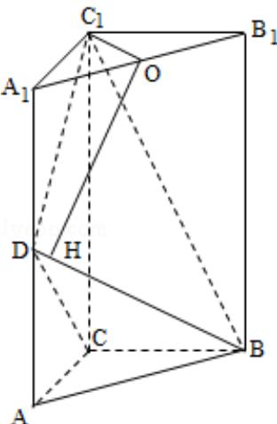

> [!faq]- 2012年全国统一高考数学试卷（理科）（新课标）（含解析版）解析
>
> > [!success]- **【答案】** 详见解析
>
> > [!note]- **【分析】**
> > （1）证明 $DC_{1} \perp BC$ ，只需证明 $DC_{1} \perp$ 面 BCD，即证明 $DC_{1} \perp DC$ ， $DC_{1} \perp BD$ ;
> > (2) 证明 BC⊥面 ACC₁A₁，可得 BC⊥AC 取 A₁B₁ 的中点 O，过点 O 作 OH⊥BD 于点 H，
>
> > [!note]- **【解析】**
> > （1）证明：在 Rt△DAC 中，AD=AC，∴∠ADC=45°
> >
> > 同理： $\angle A_{1}DC_{1}=45^{\circ}$ ， $\therefore \angle CDC_{1}=90^{\circ}$
> >
> > $$
> > \therefore D C _ {1} \perp D C, D C _ {1} \perp B D
> > $$
> >
> > ∵DC∩BD=D
> >
> > $\therefore DC_{1} \perp$ 面 BCD
> >
> > ∵BCC面 BCD
> >
> > $\therefore DC_{1} \perp BC$
> > (2) 解: $\because DC_{1} \perp BC, CC_{1} \perp BC, DC_{1} \cap CC_{1} = C_{1}, \therefore BC \perp$ 面 $ACC_{1}A_{1}$ ,
> >
> > ∵ACC⊂面 $ACC_{1}A_{1}$ ，∴BC⊥AC
> >
> > 取 $A_{1}B_{1}$ 的中点 O，过点 O 作 $OH \perp BD$ 于点 H，连接 $C_{1}O$ ，OH
> >
> > $$
> > \because A _ {1} C _ {1} = B _ {1} C _ {1}, \therefore C _ {1} O \perp A _ {1} B _ {1},
> > $$
> >
> > ∵面 $A_{1}B_{1}C_{1}\perp$ 面 $A_{1}BD$ ，面 $A_{1}B_{1}C_{1}\cap$ 面 $A_{1}BD=A_{1}B_{1}$
> >
> > $\therefore C_{1}O \perp$ 面 $A_{1}BD$
> >
> > 而 BDC 面 $A_{1}BD$
> >
> > $\therefore BD \perp C_{1}O,$
> >
> > $$
> > \because \mathrm{OH} \perp \mathrm{BD}, \mathrm{C} _ {1} \mathrm{O} \cap \mathrm{OH} = \mathrm{O},
> > $$
> >
> > $\therefore BD \perp$ 面 $C_{1}OH: C_{1}H \perp BD, \therefore$ 点 $H$ 与点 $D$ 重合且 $\angle C_{1}DO$ 是二面角 $A_{1}-BD-C_{1}$ 的平
> >
> > 面角
> >
> > 设 $AC = a$ ，则 $C_10 = \frac{\sqrt{2}a}{2}, C_1D = \sqrt{2}a = 2C_10,$
> >
> > $$
> > \therefore \sin \angle C _ {1} D O = \frac {1}{2}
> > $$
> >
> > $$
> > \therefore \angle C _ {1} D O = 3 0 ^ {\circ}
> > $$
> >
> > 即二面角 $A_{1} - B D - C_{1}$ 的大小为 $30^{\circ}$
> >
> > 
> >
> > 【点评】本题考查线面垂直，考查面面角，解题的关键是掌握线面垂直的判定，正
> >
> > 确作出面面角，属于中档题.
