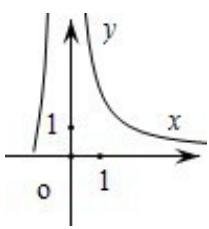
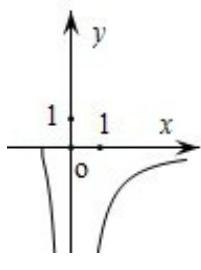
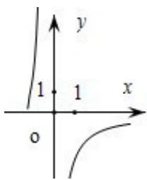
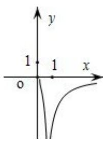

<!-- question-source:start -->
10. （5分）已知函数 $f(x) = \frac{1}{\ln(x + 1) - x}$ ，则 $y = f(x)$ 的图象大致为（）

A.

B.

C.

D.

<!-- question-source:end -->

![[高中/真题/按年份分类/2012/2012年全国统一高考数学试卷_理科__新课标__含解析版_/选择题/题目/answers/Q00024391A1.md]]
