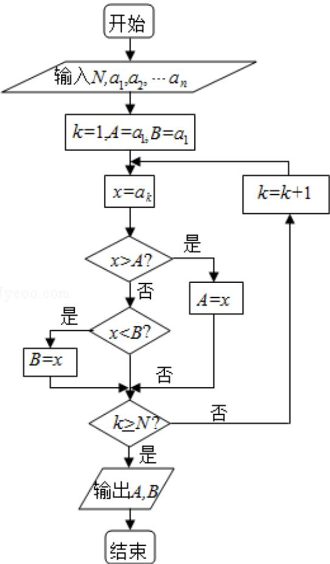

<!-- question-source:start -->
6. (5 分) 如果执行右边的程序框图, 输入正整数 $N(N \geq 2)$ 和实数 $a_{1}, a_{2}, \cdots, a_{n}$ , 输出 $A, B$ , 则 ( )

A. $A+B$ 为 $a_{1}, a_{2}, \cdots, a_{n}$ 的和

B. $\frac{A+B}{2}$ 为 $a_{1},a_{2},\cdots,a_{n}$ 的算术平均数

C. A 和 B 分别是 $a_{1}, a_{2}, \cdots, a_{n}$ 中最大的数和最小的数
D. A 和 B 分别是 $a_{1}, a_{2}, \cdots, a_{n}$ 中最小的数和最大的数
<!-- question-source:end -->

![[高中/真题/按年份分类/2012/2012年全国统一高考数学试卷_理科__新课标__含解析版_/选择题/题目/answers/Q00025423A1.md]]
