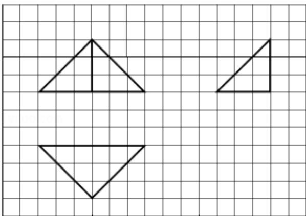

<!-- question-source:start -->
7. (5 分) 如图, 网格纸上小正方形的边长为 1, 粗线画出的是某几何体的三视图, 则此几何体的体积为 ( )

A. 6 B. 9 C. 12 D. 18
<!-- question-source:end -->

![[高中/真题/按年份分类/2012/2012年全国统一高考数学试卷_理科__新课标__含解析版_/选择题/题目/answers/Q00025424A1.md]]
