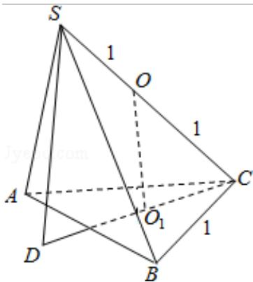

> [!faq]- 2012年全国统一高考数学试卷（理科）（新课标）（含解析版）解析
>
> > [!success]- **【答案】** C
>
> > [!note]- **【分析】**
> > 根据题意作出图形, 利用截面圆的性质即可求出 $OO_{1}$ , 进而求出底面 ABC
>
> > [!note]- **【解析】**
> > 分析】根据题意作出图形, 利用截面圆的性质即可求出 $OO_{1}$ , 进而求出底面 ABC
> >
> > 上的高 SD，即可计算出三棱锥的体积.
> >
> > 【
> > 解答】解：根据题意作出图形：
> >
> > 设球心为 O，过 ABC 三点的小圆的圆心为 $O_{1}$ ，则 $OO_{1} \perp$ 平面 ABC，
> >
> > 延长 $CO_{1}$ 交球于点 D，则 SD⊥平面 ABC.
> >
> > $$
> > \because \mathrm{CO} _ {1} = \frac {2}{3} \times \frac {\sqrt {3}}{2} = \frac {\sqrt {3}}{3},
> > $$
> >
> > $$
> > \therefore \mathrm{OO} _ {1} = \sqrt {1 - \frac {1}{3}} = \frac {\sqrt {6}}{3},
> > $$
> >
> > ∴高 SD=2OO $_{1}$ = $\frac{2\sqrt{6}}{3}$ ,
> >
> > ∵△ABC 是边长为 1 的正三角形，
> >
> > $$
> > \therefore S _ {\triangle A B C} = \frac {\sqrt {3}}{4},
> > $$
> >
> > $$
> > \therefore V _ {\text {三棱锥} S - A B C} = \frac {1}{3} \times \frac {\sqrt {3}}{4} \times \frac {2 \sqrt {6}}{3} = \frac {\sqrt {2}}{6}.
> > $$
> >
> > 故选：C.
> >
> > 
> >
> > 【点评】本题考查棱锥的体积，考查球内接多面体，解题的关键是确定点 S 到面
> > ABC 的距离.
