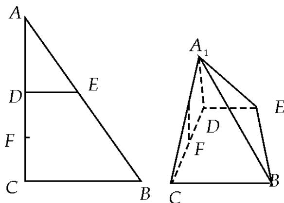
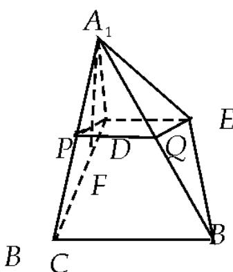

> [!faq]- 2012年北京高考文科数学试题及答案解析
>
> > [!success]- **【答案】** 详见解析
>
> > [!note]- **【分析】**
> > 本题未单列分析。
>
> > [!note]- **【解析】**
> > 解：
> > （1）因为 D, E 分别为 AC, AB 的中点，所以 $DE \parallel BC$ 。（步骤 1）又因为 $DE \not\subsetneq$ 平面 $A_{1}CB$ ，所以 $DE \parallel$ 平面 $A_{1}CB$ 。（步骤 2）
> > (2) 由已知得 $AC \perp BC$ 且 $DE \parallel BC$ , 所以
> >
> > 
> >
> > $DE \perp AC$ . 所以 $DE \perp A_{1}D$ , $DE \perp CD$ , 所以 $DE \perp$ 平面 $A_{1}DC$ . 而 $A_{1}F \subset$ 平面 $A_{1}DC$ , (步骤3)
> >
> > 所以 $DE \perp A_{1}F$ . 又因为 $A_{1}F \perp CD$ , 所以 $A_{1}F \perp$ 平面 BCDE. 所以 $A_{1}F \perp BE$ ，(步骤 4)
> > (3) 线段 $A_{1}B$ 上存在点 $Q$ , 使 $A_{1}C \perp$ 平面 $DEQ$ . 理由如下: 如图, 分别取 $A_{1}C, A_{1}B$ 的中点 $P, Q$ , 则 $PQ \parallel BC$ .
> >
> > 又因为 $DE \parallel BC$ , 所以 $DE \parallel PQ$ . 所以平面 $DEQ$ 即为平面 $DEP$ . (步骤 5)
> >
> > 由
> > （2）知 $DE \perp$ 平面 $A_{1}DC$ ，所以 $DE \perp A_{1}C$ 。（步骤6）
> >
> > 又因为 $P$ 是等腰三角形 $DA_{1}C$ 底边 $A_{1}C$ 的中点，
> >
> > 所以 $A_{1}C \perp DP$ ，所以 $A_{1}C \perp$ 平面 DEP，从而 $A_{1}C \perp$ 平面 DEQ。
> >
> > 
> >
> > 故线段 $A_{1}B$ 上存在点 Q，使得 $A_{1}C \perp$ 平面 DEQ。（步骤 7）
