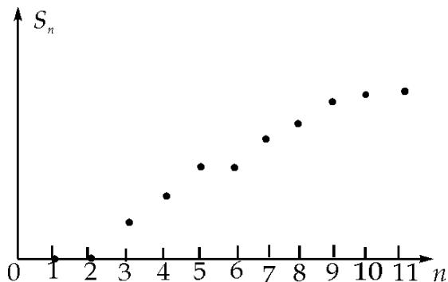

<!-- question-source:start -->
8. 某棵树树前 n 年得总产量 $S_{n}$ 与 n 之间的关系如图所示，从目前记录的结果看，前 m 年的年平均产量最高，m 的值为
( )
A.5 B.7 C.9 D.
11

【测量目标】线性分布的特点与理解.

【考查方式】给出线性分布图，求总量最高时所对应的横坐标.

【参考
<!-- question-source:end -->

![[高中/真题/按年份分类/2012/2012年北京高考文科数学试题及答案/选择题/题目/answers/Q00022144A1.md]]
