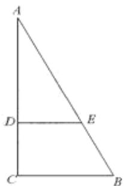
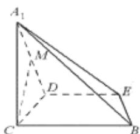

<!-- question-source:start -->
## 16. （本小题共 14 分）

如图 1, 在 Rt△ABC 中, ∠C=90°, BC=3, AC=6, D, E 分别是 AC, AB 上的点, 且 DE // BC, DE=2,

  
图1

  
图2

将 $\triangle ADE$ 沿 DE 折起到 $\triangle A_{1}DE$ 的位置，

使 $A_{1}C \perp CD,$ 如图 2.

(I)求证： $A_{1}C \perp$ 平面 BCDE；

(II)若 M 是 $A_{1}D$ 的中点，求 CM 与平面 $A_{1}BE$ 所成角的大小；

(III)线段 BC 上是否存在点 P，使平面 $A_{1}DP$ 与平面 $A_{1}BE$ 垂直？说明理由
<!-- question-source:end -->

![[高中/真题/按年份分类/2012/2012年北京高考理科数学试题及答案/填空题/题目/answers/Q00028080A1.md]]
