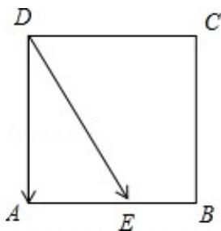

> [!faq]- 2012年北京高考理科数学试题及答案解析
>
> > [!success]- **【答案】** 1
>
> > [!note]- **【分析】**
> > 直接利用向量转化，求出数量积即可.
>
> > [!note]- **【解析】**
> > 解：因为 $\overrightarrow{\mathrm{DE}}\cdot \overrightarrow{\mathrm{CB}} = \overrightarrow{\mathrm{DE}}\cdot \overrightarrow{\mathrm{DA}} = |\overrightarrow{\mathrm{DE}}|\cdot |\overrightarrow{\mathrm{DA}}|\cos <   \overrightarrow{\mathrm{DE}}\cdot \overrightarrow{\mathrm{DA}} > = \overrightarrow{\mathrm{DA}}^2 = 1.$
> >
> > 故答案为：1
> >
> > 
> >
> > 点评：本题考查平面向量数量积的应用，考查计算能力.
