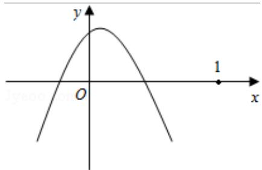

> [!faq]- 2012年北京高考理科数学试题及答案解析
>
> > [!success]- **【答案】** 为： $(-4, -2)$ .  点评：本题主要考查了全称命题与特称命题的成立，指数函数与二次函数性质的应用是
>
> > [!note]- **【分析】**
> > ① 由于 $g(x) = 2^x - 2 \geq 0$ 时, $x \geq 1$ , 根据题意有 $f(x) = m(x - 2m)(x + m + 3) < 0$ 在 $x > 1$ 时成立, 根据二次函数的性质可求
>
> > [!note]- **【解析】**
> > 分析: ① 由于 $g(x) = 2^x - 2 \geq 0$ 时, $x \geq 1$ , 根据题意有 $f(x) = m(x - 2m)(x + m + 3) < 0$ 在 $x > 1$ 时成立, 根据二次函数的性质可求
> >
> > ② 由于 $x \in (-\infty, -4)$ ， $f(x)g(x) < 0$ ，而 $g(x) = 2^x - 2 < 0$ ，则 $f(x) = m(x - 2m)$
> >
> > $$
> > (x + m + 3) > 0 \text {在} x \in (- \infty , - 4)
> > $$
> >
> > 解答：解：对于①∵g（x）=2 $^{x}$ - 2，当 x<1 时，g（x）<0，
> >
> > $$
> > \because ① \forall x \in R, f (x) <   0
> > $$
> >
> > $$
> > \mathrm{g} (\mathrm{x}) <   0
> > $$
> >
> > $$
> > \therefore \mathrm{f} (\mathrm{x}) = \mathrm{m} (\mathrm{x} - 2 \mathrm{m}) \quad (\mathrm{x} + \mathrm{m} + 3) <   0 \text {在} \mathrm{x} \geq 1
> > $$
> >
> > 则由二次函数的性质可知开口只能向下，且二次函数与 x 轴交点都在（1，0）的左面
> > 则 $\left\{\begin{aligned}&m<0\\ &-m-3<1\\ &2m<1\end{aligned}\right.$
> >
> > ∴ -4 < m < 0 即①成立的范围为 -4 < m < 0
> >
> > $$
> > \text {又} \because ② x \in (- \infty , - 4), f (x) g (x) <   0
> > $$
> >
> > $$
> > \mathrm{g} (\mathrm{x}) = 2 ^ {\mathrm{x}} - 2 <   0
> > $$
> >
> > $\therefore f(x) = m(x - 2m)(x + m + 3) > 0$ 在 $x \in (-\infty, -4)$ 有成立的可能，则只要-4比 $x_1, x_2$ 中的较小的根大即可，
> >
> > (i) 当 -1 < m < 0 时，较小的根为 -m - 3，-m - 3 < -4 不成立，
> >
> > (ii) 当 $m = -1$ 时，两个根同为 $-2 > -4$ ，不成立，
> >
> > (iii) 当 $-4 < m < -1$ 时，较小的根为 $2m$ ， $2m < -4$ 即 $m < -2$ 成立。综上可得①②成立时 $-4 < m < -2$ 。
> >
> > 故
> > 答案为： $(-4, -2)$ .
> >
> > 
> >
> > 点评：本题主要考查了全称命题与特称命题的成立，指数函数与二次函数性质的应用是
> > 解答本题的关键.
> >
> > ##
