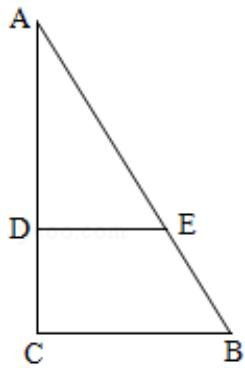
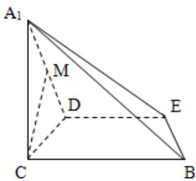

<!-- question-source:start -->
16. (14 分) (2012·北京) 如图 1, 在 Rt△ABC 中, ∠C=90°, BC=3, AC=6, D, E 分别是 AC, AB 上的点, 且 DE∥BC, DE=2, 将 △ADE 沿 DE 折起到 △A₁DE 的位置, 使 A₁C⊥CD, 如图 2.

(1) 求证: $A_{1} C \perp$ 平面 BCDE;

(2) 若 M 是 $A_{1}D$ 的中点，求 CM 与平面 $A_{1}BE$ 所成角的大小；

(3) 线段 BC 上是否存在点 P，使平面 $A_{1}DP$ 与平面 $A_{1}BE$ 垂直？说明理由.

  
图1

  
图2

考点：向量语言表述面面的垂直、平行关系；直线与平面垂直的判定；用空间向量求直线与平面的夹角.

专题：空间位置关系与距离.
<!-- question-source:end -->

![[高中/真题/按年份分类/2012/2012年北京高考理科数学试题及答案/解答题/题目/answers/Q00023152A1.md]]
