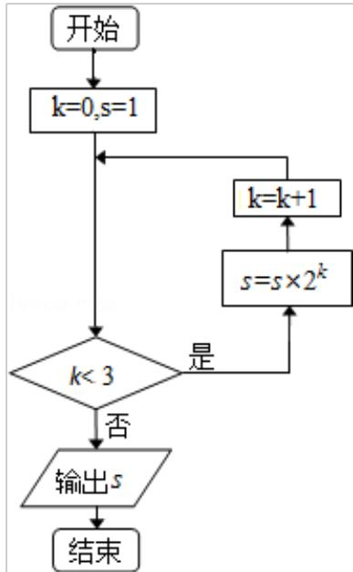

<!-- question-source:start -->
3. 设 $a, b \in \mathbb{R}$ 。“ $a=0$ ”是“复数 $a+bi$ 是纯虚数”的（）
A. 充分而不必要条件    B. 必要而不充分条件
C. 充分必要条件    D. 既不充分也不必要条件

<!-- question-source:end -->

![[高中/真题/按年份分类/2012/2012年北京高考理科数学试题及答案/选择题/题目/answers/Q00023139A1.md]]
