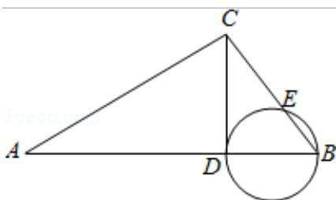

<!-- question-source:start -->
5.如图. $\angle ACB = 90^{\circ}$ , $CD \perp AB$ 于点 $D$ , 以 $BD$ 为直径的圆与 $BC$ 交于点 $E$ .则( )

A. $CE \cdot CB = AD \cdot DB$ B. $CE \cdot CB = AD \cdot AB$ C. $AD \cdot AB = CD^{2}$ D. $CE \cdot EB = CD^{2}$

<!-- question-source:end -->

![[高中/真题/按年份分类/2012/2012年北京高考理科数学试题及答案/选择题/题目/answers/Q00023141A1.md]]
