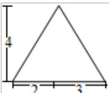
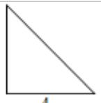
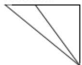

<!-- question-source:start -->
7. 某三棱锥的三视图如图所示，该三棱锥的表面积是（）

  
正（主）视图

  
4  
侧（左）视图

  
俯视图

A. $28 + 6\sqrt{5}$ B. $30 + 6\sqrt{5}$ C. $56 + 12\sqrt{5}$ D. $60 + 12\sqrt{5}$
<!-- question-source:end -->

![[高中/真题/按年份分类/2012/2012年北京高考理科数学试题及答案/选择题/题目/answers/Q00023143A1.md]]
