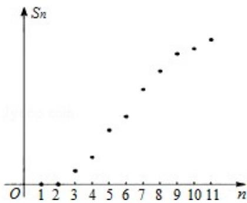

<!-- question-source:start -->
8.某棵树前 n 前的总产量 S 与 n 之间的关系如图所示.从目前记录的结果看,前 m 年的年平均产量最高。m 值为 ( )

A.5 B.7 C.9 D.11

## 第二部分(非选择题共 110 分)
<!-- question-source:end -->

![[高中/真题/按年份分类/2012/2012年北京高考理科数学试题及答案/选择题/题目/answers/Q00027409A1.md]]
