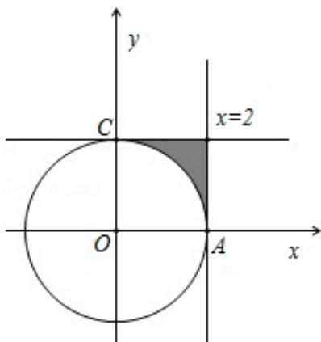

> [!faq]- 2012年北京高考理科数学试题及答案解析
>
> > [!success]- **【答案】** 详见解析
>
> > [!note]- **【分析】**
> > 本题属于几何概型, 利用 “测度” 求概率, 本例的测度即为区域的面积, 故只要求出题中两个区域: 由不等式组表示的区域和到原点的距离大于 2 的点构成的区域的面积后再求它们的比值即可.
>
> > [!note]- **【解析】**
> > 分析: 本题属于几何概型, 利用 “测度” 求概率, 本例的测度即为区域的面积, 故只要求出题中两个区域: 由不等式组表示的区域和到原点的距离大于 2 的点构成的区域的面积后再求它们的比值即可.
> >
> > 解答：解：其构成的区域 D 如图所示的边长为 2 的正方形，面积为 $S_{1}=4$ ，
> > 解答：解：其构成的区域 D 如图所示的边长为 2 的正方形，面积为 $S_{1}=4$ ，满足到原点的距离大于 2 所表示的平面区域是以原点为圆心，以 2 为半径的圆外部，面积为 $S_{2}=4-\frac{\pi \times 2^{2}}{4}=4-\pi$ ， $\therefore$ 在区域 D 内随机取一个点，则此点到坐标原点的距离大于 2 的概率 $P=\frac{4-\pi}{4}$ 故选：D.
> >
> > 
> >
> > 点评：本题考查几何概型，几何概型的概率的值是通过长度、面积、和体积、的比值得到，本题是通过两个图形的面积之比得到概率的值.
