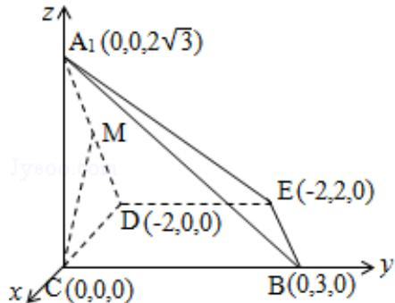

> [!faq]- 2012年北京高考理科数学试题及答案解析
>
> > [!success]- **【答案】** 详见解析
>
> > [!note]- **【分析】**
> > 本题未单列分析。
>
> > [!note]- **【解析】**
> > （1）证明：∵CD⊥DE，A₁D⊥DE，CD∩A₁D=D，
> >
> > ∴DE⊥平面 $A_{1}CD$ ,
> >
> > 又∵ $A_{1}C$ ⊂平面 $A_{1}CD$ ，∴ $A_{1}C \perp DE$
> >
> > 又 $\mathrm{A}_1\mathrm{C}\bot \mathrm{CD}$ ， $\mathrm{CD}\cap \mathrm{DE} = \mathrm{D}$
> >
> > $\therefore \mathrm{A}_{1} \mathrm{C} \perp$ 平面 BCDE
> > (2) 解: 如图建系, 则 C(0,0,0), D(-2,0,0), A₁(0,0,2√3), B(0,3,0), E(-2,2,0)
> >
> > $$
> > \therefore \overrightarrow {A _ {1} B} = (0, 3, - 2 \sqrt {3}), \overrightarrow {A _ {1} E} = (- 2, 2, - 2 \sqrt {3})
> > $$
> >
> > 设平面 $\mathrm{A}_1\mathrm{BE}$ 法向量为 $\vec{\mathbf{n}} = (x, y, z)$
> >
> > $$
> > \text {则} \left\{ \begin{array}{l} \overrightarrow {\mathrm{A} _ {1} \mathrm{B}} \cdot \overrightarrow {\mathrm{n}} = 0 \\ \overrightarrow {\mathrm{A} _ {1} \mathrm{E}} \cdot \overrightarrow {\mathrm{n}} = 0 \end{array} \therefore \left\{ \begin{array}{l} 3 \mathrm{y} - 2 \sqrt {3} \mathrm{z} = 0 \\ - 2 \mathrm{x} + 2 \mathrm{y} - 2 \sqrt {3} \mathrm{z} = 0 \end{array} \right. \therefore \left\{ \begin{array}{l} z = \frac {\sqrt {3}}{2} \mathrm{y} \\ x = - \frac {\mathrm{y}}{2} \end{array} \right. \right.
> > $$
> >
> > $$
> > \therefore \overrightarrow {n} = (- 1, 2, \sqrt {3})
> > $$
> >
> > 又∵M（-1，0， $\sqrt{3}$ ），∴ $\overrightarrow{CM}=(-1,0,\sqrt{3})$
> >
> > $$
> > \therefore \cos \theta = \frac {\overrightarrow {C M} \cdot \overrightarrow {n}}{| \overrightarrow {C M} | \cdot | \overrightarrow {n} |} = \frac {1 + 3}{\sqrt {1 + 4 + 3} \cdot \sqrt {1 + 3}} = \frac {4}{2 \cdot 2 \sqrt {2}} = \frac {\sqrt {2}}{2}
> > $$
> >
> > ∴CM 与平面 A₁BE 所成角的大小 45°
> > (3) 解：设线段 BC 上存在点 P，设 P 点坐标为 $(0, a, 0)$ ，则 $a \in [0, 3]$ $\therefore \overrightarrow{A_{1}P} = (0, a, -2\sqrt{3})$ ， $\overrightarrow{DP} = (2, a, 0)$
> >
> > 设平面 $\mathrm{A}_1\mathrm{DP}$ 法向量为 $\overrightarrow{\mathbf{n}_1} = (\mathbf{x}_1,\mathbf{y}_1,\mathbf{z}_1)$
> >
> > $$
> > \text {则} \left\{ \begin{array}{l l} {{\mathrm{ay} _ {1} - 2 \sqrt {3} z _ {1} = 0}} \\ {{2 x _ {1} + \mathrm{ay} _ {1} = 0}} \end{array} \right. \therefore \left\{ \begin{array}{l l} {{z _ {1} = \frac {\sqrt {3}}{6} \mathrm{ay} _ {1}}} \\ {{x _ {1} = - \frac {1}{2} \mathrm{ay} _ {1}}} \end{array} \right.
> > $$
> >
> > $$
> > \therefore \overrightarrow {n _ {1}} = (- 3 a, 6, \sqrt {3} a)
> > $$
> >
> > 假设平面 $\mathrm{A}_1\mathrm{DP}$ 与平面 $\mathrm{A}_1\mathrm{BE}$ 垂直，则 $\overrightarrow{\mathbf{n}_1} \cdot \overrightarrow{\mathbf{n}} = 0$
> >
> > $$
> > \begin{array}{l} \therefore 3 a + 1 2 + 3 a = 0, 6 a = - 1 2, a = - 2 \\ \because 0 \leq a \leq 3 \end{array}
> > $$
> >
> > ∴不存在线段 BC 上存在点 P，使平面 $A_{1}DP$ 与平面 $A_{1}BE$ 垂直
> >
> > 
> >
> > 点评：本题考查线面垂直，考查线面角，考查面面垂直，既有传统方法，又有向量知识的运用，要加以体会。
