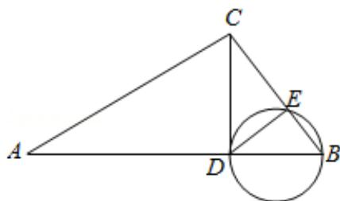

> [!faq]- 2012年北京高考理科数学试题及答案解析
>
> > [!success]- **【答案】** A
>
> > [!note]- **【分析】**
> > 连接 DE, 以 BD 为直径的圆与 BC 交于点 E, DE⊥BE, 由 $\angle ACB=90^{\circ}$ , CD⊥AB 于点 D, $\triangle ACD\sim\triangle CBD$ , 由此利用三角形相似和切割线定理, 能够推导出 CE·CB=AD·BD.
>
> > [!note]- **【解析】**
> > 解: 连接 DE,
> >
> > ∵以 BD 为直径的圆与 BC 交于点 E,
> > ∴DE⊥BE,
> > ∵∠ACB=90°, CD⊥AB 于点 D,
> > ∴△ACD∼△CBD,
> > ∴ $\frac{CD}{BD}=\frac{AD}{CD}$ ,
> > ∴ $CD^{2}=AD\cdot BD$ .
> > ∵ $CD^{2}=CE\cdot CB$ ,
> > ∴CE·CB=AD·BD,
> >
> > 故选A.
> >
> > 
> >
> > 点评：本题考查与圆有关的比例线段的应用，是基础题。解题时要认真审题，仔细
