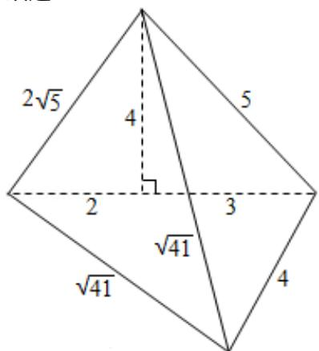

> [!faq]- 2012年北京高考理科数学试题及答案解析
>
> > [!success]- **【答案】** B
>
> > [!note]- **【分析】**
> > 通过三视图复原的几何体的形状，利用三视图的数据求出几何体的表面积即可.
>
> > [!note]- **【解析】**
> > 分析：通过三视图复原的几何体的形状，利用三视图的数据求出几何体的表面积即可.
> >
> > 解答：解：三视图复原的几何体是底面为直角边长为4和5的三角形，一个侧面垂直底面的等腰三角形，高为4，底边长为5，如图，
> >
> > 所以 $S_{底}=\frac{1}{2}\times4\times5=10$ ,
> >
> > $S_{后}=\frac{1}{2}\times5\times4=10,$ $S_{右}=\frac{1}{2}\times4\times5=10,$ $S_{左}=\frac{1}{2}\times2\sqrt{5}\times\sqrt{\left(\sqrt{41}\right)^{2}-\left(\sqrt{5}\right)^{2}}=6\sqrt{5}.$
> >
> > 几何体的表面积为： $S=S_{底}+S_{后}+S_{右}+S_{左}=30+6\sqrt{5}$
> >
> > 故选：B.
> >
> > 
> >
> > 点评：本题考查三视图与几何体的关系，注意表面积的求法，考查空间想象能力计算能力.
