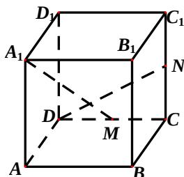

<!-- question-source:start -->
14、如图，在正方体 $ABCD - A_{1}B_{1}C_{1}D_{1}$ 中， $M$ 、 $N$ 分别是 $CD$ 、 $CC_{1}$ 的中点，则异面直线 $A_{1}M$ 与 $DN$ 所成的角的大小是\_\_\_\_。

<!-- question-source:end -->

![[高中/真题/按年份分类/2012/2012年四川高考文科数学试卷_word版_和答案/填空题/题目/answers/Q00026578A1.md]]
