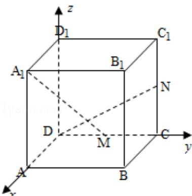

> [!faq]- 2012年四川高考文科数学试卷(word版)和答案解析
>
> > [!success]- **【答案】** 为： $90^{\circ}$ .  点评：本题考查空间异面直线的夹角求解，采用了向量的方法。向量的方法能降低空间想象难度，但要注意有关点，向量坐标的准确。否则容易由于计算失误而出错。
>
> > [!note]- **【分析】**
> > 以 D 为坐标原点, 建立空间直角坐标系, 利用向量的方法求出 $\overrightarrow{DN}$ 与 $\overrightarrow{A_1M}$ 夹角求出异面直线 $A_1M$ 与 DN 所成的角.
>
> > [!note]- **【解析】**
> > 分析: 以 D 为坐标原点, 建立空间直角坐标系, 利用向量的方法求出 $\overrightarrow{DN}$ 与 $\overrightarrow{A_1M}$ 夹角求出异面直线 $A_1M$ 与 DN 所成的角.
> >
> > 解答：解：以 D 为坐标原点，建立如图所示的空间直角坐标系．设棱长为 2，
> >
> > 则 D(0,0,0), N(0,2,1), M(0,1,0), A₁(2,0,2), $\overrightarrow{DN}=(0,2,1)$ , $\overrightarrow{A_{1}M}=(-2,1,-2)$
> >
> > $\overrightarrow{\mathrm{DN}} \cdot \overrightarrow{\mathrm{A}_1\mathbb{M}} = 0$ ，所以 $\overrightarrow{\mathrm{DN}} \perp \overrightarrow{\mathrm{A}_1\mathbb{M}}$ ，即 $\mathrm{A}_1\mathrm{M} \perp \mathrm{DN}$ ，异面直线 $\mathrm{A}_1\mathrm{M}$ 与 DN 所成的角的大小是 $90^\circ$ ，
> >
> > 故
> > 答案为： $90^{\circ}$ .
> >
> > 
> >
> > 点评：本题考查空间异面直线的夹角求解，采用了向量的方法。向量的方法能降低空间想象难度，但要注意有关点，向量坐标的准确。否则容易由于计算失误而出错。
