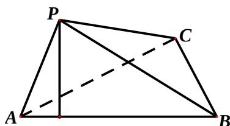

<!-- question-source:start -->
17、(本小题满分 12 分)

某居民小区有两个相互独立的安全防范系统（简称系统）A 和 B，系统 A 和系统 B 在任意时刻发生故障的概率分别为 $\frac{1}{10}$ 和 p。

（Ⅰ）若在任意时刻至少有一个系统不发生故障的概率为 $\frac{49}{50}$ ，求 $p$ 的值；

（Ⅱ）求系统 A 在 3 次相互独立的检测中不发生故障的次数大于发生故障的次数的概率。

## 18、(本小题满分 12 分)

已知函数 $f(x)=\cos^{2}\frac{x}{2}-\sin\frac{x}{2}\cos\frac{x}{2}-\frac{1}{2}$ 。

（Ⅰ）求函数 $f(x)$ 的最小正周期和值域；

（Ⅱ）若 $f(\alpha)=\frac{3\sqrt{2}}{10}$ ，求 $\sin 2\alpha$ 的值。

## 19、(本小题满分 12 分)

如图，在三棱锥 P-ABC 中， $\angle APB=90^{\circ}$ ， $\angle PAB=60^{\circ}$ ，AB=BC=CA，点 P 在平面 ABC 内的射影 O 在 AB 上。

(Ⅰ) 求直线 PC 与平面 ABC 所成的角的大小;

(II) 求二面角 B - AP - C 的大小。

## 20、(本小题满分 12 分)

已知数列 $\{a_{n}\}$ 的前 $n$ 项和为 $S_{n}$ ，常数 $\lambda > 0$ ，且 $\lambda a_{1}a_{n} = S_{1} + S_{n}$ 对一切正整数 $n$ 都成立。

（Ⅰ）求数列 $\{a_{n}\}$ 的通项公式；

（Ⅱ）设 $a_1 > 0$ ， $\lambda = 100$ ，当 $n$ 为何值时，数列 $\{\lg \frac{1}{a_n}\}$ 的前 $n$ 项和最大？

## 21、(本小题满分 12 分)

如图，动点 M 与两定点 $A(-1,0)$ 、 $B(1,0)$ 构成 $\Delta MAB$ ，且直线 MA、MB 的斜率之积为 4，设动点 M 的轨迹为 C。

（Ⅰ）求轨迹C的方程；

（Ⅱ）设直线 $y = x + m (m > 0)$ 与 y 轴交于点 P，

与轨迹 C 相交于点 $Q \setminus R$ ，且 $|PQ| < |PR|$ ，求 $\frac{|PR|}{|PQ|}$ 的取值范围。

## 22、(本小题满分 14 分)

已知 a 为正实数，n 为自然数，抛物线 $y = -x^{2} + \frac{a^{n}}{2}$ 与 x 轴正半轴相交于点 A，设 $f(n)$ 为该抛物线在点 A 处的切线在 y 轴上的截距。

(Ⅰ) 用 a 和 n 表示 $f(n)$ ;

（II）求对所有 $n$ 都有 $\frac{f(n) - 1}{f(n) + 1} \geq \frac{n}{n + 1}$ 成立的 $a$ 的最小值；

（III）当 $0 < a < 1$ 时，比较 $\frac{1}{f(1) - f(2)} + \frac{1}{f(2) - f(4)} + \dots + \frac{1}{f(n) - f(2n)}$ 与 $6\frac{f(1) - f(n + 1)}{f(0) - f(1)}$ 的大小，并说明理由。

## 2012 年四川省高考数学试卷（文科）

参考
<!-- question-source:end -->

![[高中/真题/按年份分类/2012/2012年四川高考文科数学试卷_word版_和答案/解答题/题目/answers/Q00026581A1.md]]
