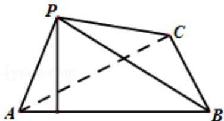

<!-- question-source:start -->
19. (12 分) (2012·四川) 如图, 在三棱锥 P - ABC 中, $\angle APB = 90^{\circ}$ , $\angle PAB = 60^{\circ}$ , $AB = BC = CA$ , 点 P 在平面 ABC 内的射影 O 在 AB 上.

（Ⅰ）求直线 PC 与平面 ABC 所成的角的大小；

（Ⅱ）求二面角 B - AP - C 的大小.

考点：用空间向量求平面间的夹角；直线与平面所成的角；二面角的平面角及求法.

专题：综合题.
<!-- question-source:end -->

![[高中/真题/按年份分类/2012/2012年四川高考文科数学试卷_word版_和答案/解答题/题目/answers/Q00026584A1.md]]
