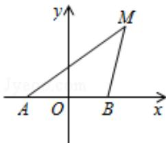

<!-- question-source:start -->
21.（12分）(2012·四川)如图，动点M与两定点A（-1,0）、B(1,0)构成△MAB，且直线MA、MB的斜率之积为4，设动点M的轨迹为C.

（Ⅰ）求轨迹 C 的方程；

（II）设直线 $y=x+m$ (m>0) 与 y 轴交于点 P，与轨迹 C 相交于点 Q、R，且 $|PQ|<|PR|$ ，求 $\frac{|PR|}{|PQ|}$ 的取值范围.

考点：直线与圆锥曲线的综合问题；圆锥曲线的轨迹问题.

专题：综合题；压轴题。
<!-- question-source:end -->

![[高中/真题/按年份分类/2012/2012年四川高考文科数学试卷_word版_和答案/解答题/题目/answers/Q00026586A1.md]]
