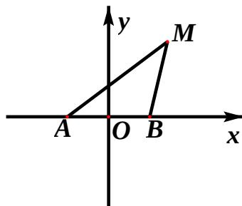

<!-- question-source:start -->
## 21、(本小题满分 12 分)

如图，动点 M 与两定点 $A(-1,0)$ 、 $B(1,0)$ 构成 $\Delta MAB$ ，且直线 MA、MB 的斜率之积为 4，设动点 M 的轨迹为 C。

（Ⅰ）求轨迹C的方程；

（Ⅱ）设直线 $y = x + m (m > 0)$ 与 y 轴交于点 P，

与轨迹 C 相交于点 $Q \setminus R$ ，且 $|PQ| < |PR|$ ，求 $\frac{|PR|}{|PQ|}$ 的取值范围。
<!-- question-source:end -->

![[高中/真题/按年份分类/2012/2012年四川高考文科数学试卷_word版_和答案/解答题/题目/answers/Q00028101A1.md]]
