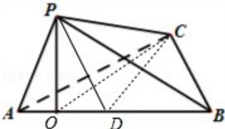
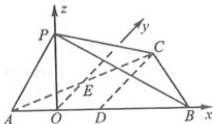
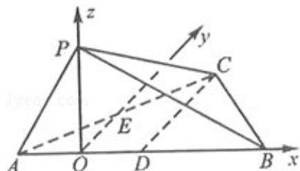

> [!faq]- 2012年四川高考文科数学试卷(word版)和答案解析
>
> > [!success]- **【答案】** 详见解析
>
> > [!note]- **【分析】**
> > 解法一（Ⅰ）连接 OC，由已知， $\angle OCP$ 为直线 PC 与平面 ABC 所成的角。设 AB 中点为 D，连接 PD，CD。不妨设 PA=2，则 $OD=1,\ OP=\sqrt{3}, AB=4$ 。在 RT $\triangle OCP$ 中求解。
>
> > [!note]- **【解析】**
> > 解法一
> >
> > （Ⅰ）连接 OC，由已知， $\angle OCP$ 为直线 PC 与平面 ABC 所成的角.
> >
> > 
> >
> > 设 AB 中点为 D，连接 PD，CD．因为 AB=BC=CA，所以 CD⊥AB，因为 $\angle APB=90^{\circ}$ ， $\angle PAB=60^{\circ}$ ，所以 $\triangle PAD$ 为等边三角形，
> >
> > 不妨设 PA=2，则 OD=1， $OP=\sqrt{3}$ ，AB=4。
> >
> > 所以 $\mathrm{CD} = 2\sqrt{3}$ ， $\mathrm{OC} = \sqrt{\mathrm{OD}^2 + \mathrm{CD}^2} = \sqrt{1 + 12} = \sqrt{13}$
> >
> > 在 $\mathrm{RT}\triangle \mathrm{OCP}$ 中， $\tan \angle \mathrm{OCP} = \frac{\mathrm{OP}}{\mathrm{OC}} = \frac{\sqrt{3}}{\sqrt{13}} = \frac{\sqrt{39}}{13}.$
> >
> > 故直线 PC 与平面 ABC 所成的角的大小为 $\arctan\frac{\sqrt{39}}{13}$ .
> >
> > （Ⅱ）由（Ⅰ）知，以O为原点，建立空间直角坐标系.则 $\overrightarrow{\mathrm{AP}} = (1,0,\sqrt{3})$ ， $\overrightarrow{\mathrm{AC}} = (2,2\sqrt{3}$ ，0）.
> >
> > 
> >
> > 设平面 APC 的一个法向量为 $\vec{n}=(x,y,z)$ ，则由 $\left\{\begin{aligned}\vec{n}&\perp\overrightarrow{AP}\\ \vec{n}&\perp\overrightarrow{AC}\end{aligned}\right.$ 得出 $\left\{\begin{aligned}\vec{n}&\cdot\overrightarrow{AP}=0\\ \vec{n}&\cdot\overrightarrow{AC}=0\end{aligned}\right.$ 即 $\left\{\begin{aligned}x+\sqrt{3}z=0\\2x+2\sqrt{3}y=0\end{aligned}\right.$ ，取 $x=-\sqrt{3}$ ，则 y=1, z=1，所以 $\vec{n}=(-\sqrt{3},1,1)$ 。设二面角 B-AP-C 的平面角为 $\beta$ ，易知 $\beta$ 为锐角。而面 ABP 的一个法向量为 $\vec{n}= (0,1,0)$ ，则 $\cos\beta=\left|\frac{\vec{n}\cdot\vec{m}}{|\vec{n}|\cdot|\vec{m}|}\right|=\left|\frac{1}{\sqrt{3+1+1}}\right|=\frac{\sqrt{5}}{5}$ 。故二面角 B-AP-C 的大小为 $\arccos\frac{\sqrt{5}}{5}$ 。
> >
> > 解法二：（Ⅰ）设 AB 中点为 D，连接 CD. 因为 O 在 AB 上，且 O 为 P 在平面 ABC 内的射影，
> >
> > 
> >
> > 所以 PO⊥平面 ABC，所以 PO⊥AB，且 PO⊥CD。因为 AB=BC=CA，所以 CD⊥AB，设 E 为 AC 中点，则 EO∥CD，从而 OE⊥PO，OE⊥AB。
> >
> > 如图，以 O 为坐标原点，OB, OE, OP 所在直线分别为 x, y, z 轴建立空间直角坐标系 O - xyz. 不妨设 PA=2，由已知可得，AB=4，OA=OD=1，OP= $\sqrt{3}$ ，CD=2 $\sqrt{3}$ ，所以 O(0,0,0)，A(-1,0,0)，C(1,2 $\sqrt{3}$ ,0)，P(0,0, $\sqrt{3}$ )，所以 $\overrightarrow{CP}=(-1,-2\sqrt{3},\sqrt{3})\overrightarrow{OP}=(0,0,\sqrt{3})$ 为平面 ABC 的一个法向量.
> >
> > 设 $\alpha$ 为直线PC与平面ABC所成的角，则 $\sin \alpha = \left|\frac{\overrightarrow{CP} \cdot \overrightarrow{OP}}{|\overrightarrow{CP}| \cdot |\overrightarrow{OP}|}\right| = \frac{0 + 0 + 3}{\sqrt{16} \cdot \sqrt{3}} = \frac{\sqrt{3}}{4}$ . 故直线PC与平面ABC所成的角大小为 $\arcsin \frac{\sqrt{3}}{4}$
> >
> > （Ⅱ）由（Ⅰ）知， $\overrightarrow{AP} = (1, 0, \sqrt{3})$ ， $\overrightarrow{AC} = (2, 2\sqrt{3}, 0)$ 。
> >
> > 设平面 APC 的一个法向量为 $\vec{n} = (x, y, z)$ ，则由 $\left\{\begin{aligned}\vec{n} &\perp \overrightarrow{AP}\\ \vec{n} &\perp \overrightarrow{AC}\end{aligned}\right.$ 得出 $\left\{\begin{aligned}\vec{n} &\cdot \overrightarrow{AP}=0\\ \vec{n} &\cdot \overrightarrow{AC}=0\end{aligned}\right.$ 即
> >
> > $$
> > \left\{ \begin{array}{l} x + \sqrt {3} z = 0 \\ 2 x + 2 \sqrt {3} y = 0 ^ {\prime} \end{array} \right.
> > $$
> >
> > 取 $x = -\sqrt{3}$ , 则 $y = 1, z = 1$ , 所以 $\vec{n} = (-\sqrt{3}, 1, 1)$ . 设二面角 B - AP - C 的平面角为 $\beta$ , 易知 $\beta$ 为锐角.
> >
> > 而面ABP的一个法向量为 $\vec{\pi} = (0,1,0)$ ，则 $\cos \beta = \left|\frac{\vec{n}\cdot\vec{m}}{|\vec{n}|*\vec{m}|}\right| = \left|\frac{1}{\sqrt{3 + 1 + 1}}\right| = \frac{\sqrt{5}}{5}.$ 故二面角B-AP-C的大小为 $\arccos \frac{\sqrt{5}}{5}$
> >
> > 点评：本题考查线面关系，直线与平面所成的角、二面角等基础知识，考查思维能力、空间想象能力，并考查应用向量知识解决数学问题能力。
