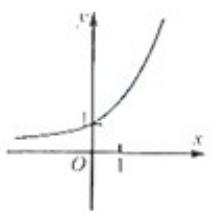
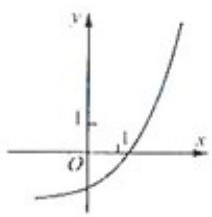
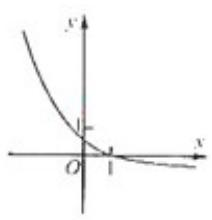
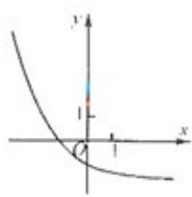

<!-- question-source:start -->
4、函数 $y = a^{x} - a (a > 0, a \neq 1)$ 的图象可能是（）

  
(A)

  
(B)

  
(C)

  
(D)
<!-- question-source:end -->

![[高中/真题/按年份分类/2012/2012年四川高考文科数学试卷_word版_和答案/选择题/题目/answers/Q00026568A1.md]]
