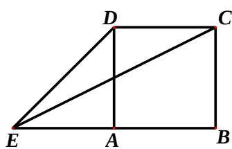

<!-- question-source:start -->
5、如图，正方形ABCD的边长为1，延长BA至E，使AE=1，连接EC、

$ED$ 则 $\sin \angle CED = (\quad)$ A、 $\frac{3\sqrt{10}}{10}$ B、 $\frac{\sqrt{10}}{10}$ C、 $\frac{\sqrt{5}}{10}$ D、 $\frac{\sqrt{5}}{15}$

<!-- question-source:end -->

![[高中/真题/按年份分类/2012/2012年四川高考文科数学试卷_word版_和答案/选择题/题目/answers/Q00026569A1.md]]
